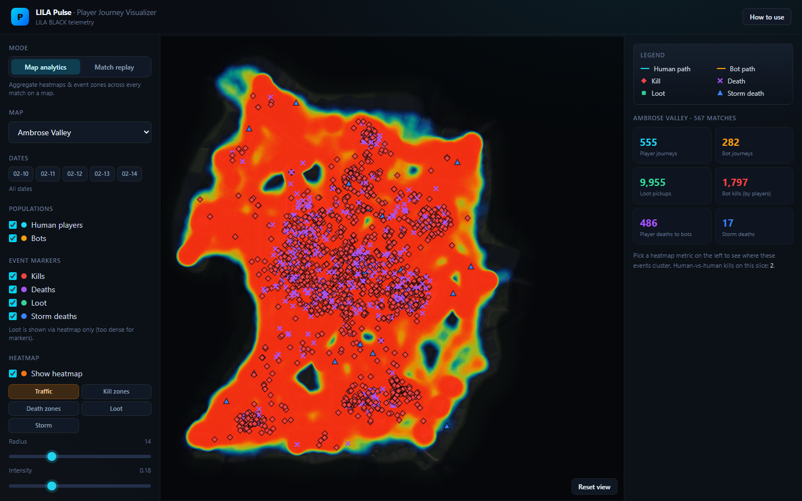
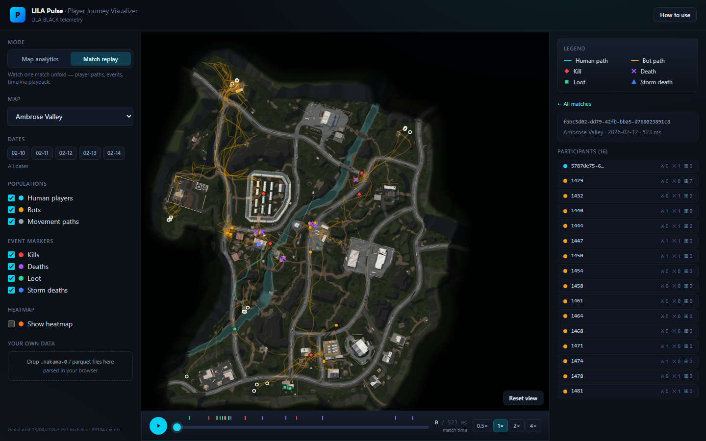

# LILA Pulse — Player Journey Visualization Tool

A web tool that turns raw **LILA BLACK** telemetry (`.nakama-0` parquet match
files) into something a **level designer** can open in the browser and actually
use: player paths on the real minimap, kill/death/loot/storm markers, heatmaps,
and match playback.

> **Live demo:** _add your deployed URL here after running the deploy step
> below (Vercel/Netlify)._



---

## What it does

| Requirement | How it's met |
|---|---|
| Load & parse parquet | Python pipeline → compact JSON **and** in-browser parquet parsing (hyparquet) |
| Player journeys on the correct minimap | World `(x, z)` → minimap pixels via the per-map scale/origin from the README |
| Humans vs bots | Cyan = humans (UUID ids), amber = bots (numeric ids); toggle each |
| Event markers | ◆ kill · ✕ death · ▣ loot · ▲ storm death — distinct shapes & colors |
| Filter by map / date / match | Left panel map + day chips; right panel searchable, sortable match list |
| Timeline / playback | Scrubber, play/pause, 0.5–4× speed; paths draw as the match progresses |
| Heatmaps | Traffic, kill zones, death zones, loot, storm — tunable radius/intensity |
| Hosted, shareable | Static build, deploy to Vercel/Netlify in one step |
| **Plug-and-play future data** | Drop new parquet files in the browser, or re-run the pipeline |

Two modes:

- **Map analytics** — aggregate heatmaps and event zones across *every* match on
  a map, filtered by date.
- **Match replay** — pick one match, watch player paths and events unfold on a
  timeline.



---

## Tech stack

- **React + TypeScript + Vite** — fast static SPA, deploys anywhere.
- **Tailwind CSS v4** — styling.
- **HTML Canvas 2D** — custom renderer for paths, markers and a dependency-free
  thermal heatmap (fast for ~90k points, full control over the coordinate
  transform).
- **hyparquet** — reads parquet **in the browser** so designers can drop new
  data with no backend.
- **Python + pyarrow/pandas** — offline pipeline that pre-bakes the bundled
  dataset into compact JSON.

See [ARCHITECTURE.md](ARCHITECTURE.md) for the data flow and coordinate-mapping
walkthrough, and [INSIGHTS.md](INSIGHTS.md) for three findings from the data.

---

## Run locally

```bash
# 1. install
npm install

# 2. (optional) regenerate the bundled dataset from raw parquet
#    defaults to ../Test/player_data — override with --input
npm run pipeline
#    or: python pipeline/process.py --input /path/to/player_data

# 3. dev server
npm run dev          # http://localhost:5173

# 4. production build + preview
npm run build
npm run preview
```

`npm install` requires Node 18+. The pipeline requires Python 3.10+ with
`pyarrow` and `pandas` (`pip install pyarrow pandas`).

---

## Deploy (get a shareable link)

The app is a static site (`dist/`). Either platform works out of the box —
config files are included.

**Vercel**
```bash
npm i -g vercel
vercel            # follow prompts; framework auto-detected (vite.json included)
vercel --prod
```

**Netlify**
```bash
npm i -g netlify-cli
netlify deploy --build --prod   # uses netlify.toml
```

Both serve `dist/`, which already contains the generated `data/` and
`minimaps/`. No environment variables are required.

---

## Bringing your own data

Two paths, both documented in-app under **How to use**:

1. **Browser (no setup):** in the left panel, drop `.nakama-0` / parquet files.
   They're parsed client-side and rendered immediately. Nothing is uploaded.
2. **Permanent dataset:** drop new day-folders into your `player_data` directory
   and re-run `npm run pipeline`. The tool reads whatever the pipeline emits, so
   new maps/dates/matches appear automatically (add new maps to `MAP_CONFIG` in
   `pipeline/process.py` and `src/lib/types.ts` mirrors them from the manifest).

---

## Project layout

```
pipeline/process.py     parquet -> manifest.json + match/*.json + heatmap/*.json
public/data/            generated dataset (committed for instant demo)
public/minimaps/        minimap images
src/lib/                types, coordinate transform, data clients, heatmap, selectors
src/components/         MapCanvas, Sidebar, Timeline, StatsPanel, HelpModal
ARCHITECTURE.md         one-page design doc
INSIGHTS.md             three data-backed findings
```

---

## Assumptions

Documented in full in [ARCHITECTURE.md](ARCHITECTURE.md#assumptions). The two
that matter most:

- **`ts` is a compressed/relative match clock** (matches span ~0.01–0.9s of
  stored time). It's treated as a *relative timeline* — playback stretches each
  match to a watchable ~12s at 1× and the readout shows raw match-ms.
- **`y` is elevation** and is intentionally not plotted; the minimap is top-down
  `(x, z)` per the dataset README.
